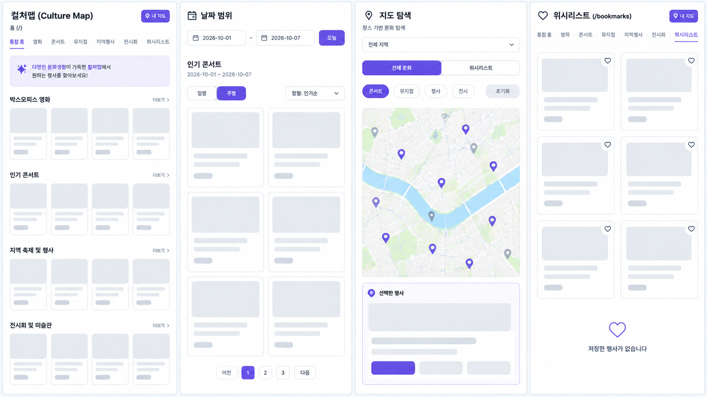

# [프로젝트 기획서] 컬쳐맵 (Culture Map)

> **Tech Stack**: Next.js (App Router / JavaScript), React, Tailwind CSS, TanStack Query, Zustand, Naver Maps SDK

코드 리뷰와 상태 관리 학습은 [프로젝트 학습 가이드](./STUDY_GUIDE.md)를 참고하세요. 가이드는 현재 구현 기준으로 props, React state, Zustand, TanStack Query의 데이터 흐름을 설명합니다.

---

## 현재 구현 현황

아래 표는 2026년 9월 기준 소스 코드에서 확인되는 동작입니다. 이후 절의 기능 명세와 화면/API/state 설계는 초기 기획이며, 완료된 기능을 뜻하지 않습니다.

| 영역 | 실제 구현 | 초기 기획과 다른 점 / 미구현 항목 |
| --- | --- | --- |
| 홈 (`/`) | Zustand의 시작일·종료일 범위로 카테고리별 데이터를 조회해 카드 그리드와 로딩·오류·빈 상태를 표시합니다. 일부 API 실패는 `Promise.allSettled`로 격리합니다. | 수평 캐러셀 대신 그리드입니다. 홈 영화 섹션은 KOBIS 결과를 사용합니다. |
| 카테고리 목록 | 공통 `CultureCategoryPage`가 10개씩 페이지네이션합니다. 영화는 KOBIS 일일/주말 박스오피스, 나머지 카테고리는 날짜 범위에 겹치는 JSON Server 일정을 표시합니다. 영화 정렬은 순위·관객·매출·이름, 그 외는 인기·시작일·이름입니다. | KOBIS 영화 응답은 최대 10개라 보통 한 페이지입니다. 다른 카테고리는 필터 결과에 따라 페이지 수가 달라집니다. |
| 영화 카드 | 순위, 당일/주말 관객·스크린·상영 횟수, 기간 매출, 누적 매출, 매출 점유율과 개봉일을 표시합니다. 포스터 URL이 없을 때는 타이포그래피 커버를 표시하고 네이버 상영시간표 검색 링크를 제공합니다. | KOBIS 박스오피스 응답에는 포스터나 극장별 실제 상영시간표가 없습니다. 네이버 링크는 검색 링크이지 상영 여부 확정 정보가 아닙니다. |
| 지도 (`/map`) | Naver Maps에 좌표가 있는 문화 항목의 마커를 표시합니다. 범례에서 여러 카테고리를 선택/해제할 수 있고, 마커를 누르면 상세 패널을 엽니다. 지도 확대/축소 컨트롤은 숨겨져 있습니다. | 마커 클러스터, 현재 위치 이동, 거리 계산은 구현되어 있지 않습니다. |
| 데이터/API | 영화 박스오피스는 `/api/box-office`가 KOBIS를 서버에서 호출합니다. 극장 인허가 마스터는 `/api/movie-theaters` 및 `fetchMovieTheaters()`로 조회할 수 있습니다. 콘서트·뮤지컬·행사·전시는 JSON Server(`http://localhost:4000`)의 `db.json`을 사용합니다. | 극장 마스터는 영화별 상영 일정이 아닙니다. 포스터 주소도 별도 제공처가 필요합니다. JSON Server 주소는 `NEXT_PUBLIC_CULTURE_API_URL`, KOBIS 키는 서버 환경변수 `KOBIS_API_KEY`, 극장 마스터 키는 `MOVIE_THEATERS_SERVICE_KEY`로 설정합니다. |
| 상태 관리 | 시작일·종료일·지역·선택 마커는 Zustand, 북마크는 Zustand `persist`와 LocalStorage, API 응답은 TanStack Query, 정렬·페이지·박스오피스 모드·지도 카테고리 선택은 로컬 state입니다. | 날짜 범위와 지역은 URL query parameter에 동기화되지 않습니다. 북마크만 새로고침 후 유지됩니다. |

---

## 1. 프로젝트 기본 정보

* **프로젝트명**: 컬쳐맵 (Culture Map)
* **한 줄 소개**: 영화, 콘서트, 뮤지컬, 지역 행사, 전시 정보를 날짜와 지역 기준으로 한눈에 확인하고 지도에서 위치까지 탐색하는 통합 문화생활 서비스
* **타겟 사용자**:
* 주말 및 휴일에 즐길 거리를 찾는 사람
* 영화·공연·전시·지역 행사를 단일 플랫폼에서 비교·탐색하고 싶은 사람
* 현재 위치 또는 특정 지역 주변의 문화 행사를 지도 기반으로 찾고 싶은 사람
* 날짜별, 인기순·최신순·예매율순으로 문화생활 일정을 가공하여 계획하고 싶은 사람


---

## 2. 기능 명세 (초기 기획)

> **개발 타임라인**: 5일 이내 MVP 완성 (필수 기능 4개 + 선택 기능 2개)

| 구분 | 기능명 | 사용자 행동 | 완료 기준 (Definition of Done) |
| --- | --- | --- | --- |
| **필수 1** | **날짜 기반 통합 홈 조회** | 날짜 피커를 변경하거나 기본 날짜로 홈 접속 | 선택한 날짜 기준 영화/콘서트/뮤지컬/행사/전시 5개 섹션 데이터가 정상 표시됨 |
| **필수 2** | **카테고리별 콘텐츠 목록** | 각 카테고리(영화, 공연 등) 페이지 접속 | API 연동 카드 목록 표시 (포스터, 제목, 날짜, 장소, 가격 등) |
| **필수 3** | **정렬 및 예매율 확인** | 정렬 Select에서 최신순/인기순/예매율순 선택 | 정렬 기준 변경 시 목록 즉시 재정렬. 예매율 미제공 카테고리는 옵션 숨김 처리 |
| **필수 4** | **지도 기반 행사 위치 확인** | '지도 보기' 클릭 또는 행사 카드 선택 | 행사 좌표 기준 Naver Map 마커 표시, 마커 클릭 시 행사명/장소 인포윈도우 노출 |
| **선택 1** | **행사 상세 모달/페이지** | 카드 또는 지도 마커 클릭 | 상세 포스터, 설명, 기간, 시간, 장소, 가격, 예매 URL 표시 |
| **선택 2** | **관심 행사 저장 (북마크)** | 카드 내 하트(북마크) 버튼 클릭 | LocalStorage 연동으로 찜 추가/삭제 처리 및 새로고침 후에도 상태 유지 |

---

## 3. 화면 및 레이아웃 구조 (초기 기획)

```
[통합 홈] ---> [카테고리별 목록 (영화/콘서트/뮤지컬/행사/전시)]
   │                     │
   ├───> [지도 화면] <────┘
   │         │
   └───> [행사 상세 모달/페이지]

```


### 화면별 주요 요소 및 인터랙션

1. **화면 1. 통합 홈 (`/`)**
* **구성**: 날짜 선택 헤더, 카테고리별 5개 캐러셀/수평 스크롤 섹션
* **인터랙션**: 날짜 변경 시 전 섹션 데이터 Re-fetch, 카테고리 '더보기' 클릭 시 해당 카테고리 목록으로 이동


2. **화면 2. 영화 목록 (`/movies`)**
* **구성**: 영화 카드, 포스터, 개봉일, 예매율, 누적 관객 수, 정렬 Select
* **인터랙션**: 최신순·인기순·예매율순 정렬, 클릭 시 상세 보기


3. **화면 3. 콘서트 목록 (`/concerts`)**
* **구성**: 공연 포스터, 공연명, 기간, 장소, 예매 순위, 정렬 Select
* **인터랙션**: 최신순·인기순 정렬, 카테고리 필터링


4. **화면 4. 뮤지컬 목록 (`/musicals`)**
* **구성**: 공연 포스터, 공연명, 기간, 공연장, 티켓 가격, 정렬 Select
* **인터랙션**: 최신순·인기순 정렬, 상세 보기 이동


5. **화면 5. 지역 행사 목록 (`/festivals`)**
* **구성**: 행사명, 기간, 지역 태그, 장소, 무료/유료 여부, 필터
* **인터랙션**: 지역(시/도) 필터, 날짜 필터, 최신순 정렬


6. **화면 6. 전시회 목록 (`/exhibitions`)**
* **구성**: 전시명, 전시 기간, 미술관/박물관명, 관람료, 썸네일
* **인터랙션**: 지역 필터, 날짜 필터, 정렬


7. **화면 7. 지도 화면 (`/map`)**
* **구성**: 전체 화면 지도, 카테고리 필터 바, 선택된 행사 바텀시트/사이드 패널
* **인터랙션**: 마커 클러스터/클릭, 현재 위치로 이동, 내 위치 기반 거리 계산


8. **화면 8. 콘텐츠 상세 (`/culture/[id]` 또는 Modal)**
* **구성**: 고화질 포스터, 기본 정보, 카카오맵 미니 지도, 예매 링크 버튼
* **인터랙션**: 예매 외부 링크 이탈, 북마크 토글


---

## 4. 데이터 계획 (초기 기획)

### JavaScript 객체 구조 (JSDoc 기준)

```javascript
/**
 * @typedef {Object} CultureItem
 * @property {string} id - 콘텐츠 고유 ID (예: "movie-1", "kopis-PF1234")
 * @property {'movie' | 'concert' | 'musical' | 'festival' | 'exhibition'} type - 콘텐츠 카테고리
 * @property {string} title - 콘텐츠 제목
 * @property {string} imageUrl - 포스터/썸네일 이미지 URL
 * @property {string} description - 상세 설명
 * @property {string} startDate - 시작일 (YYYY-MM-DD)
 * @property {string} endDate - 종료일 (YYYY-MM-DD)
 * @property {string} locationName - 장소명
 * @property {string} address - 상세 주소
 * @property {number} latitude - 위도
 * @property {number} longitude - 경도
 * @property {string} price - 가격 정보 ("무료", "15,000원", "R석 120,000원")
 * @property {number|null} popularityRank - 인기/박스오피스 순위
 * @property {number|null} reservationRate - 예매율 (영화 등)
 * @property {string} detailUrl - 외부 예매/상세 페이지 링크
 * @property {'KOBIS' | 'KOPIS' | 'CulturePortal'} source - 데이터 출처
 */

```

### Mock Data 예시 (`db.json`)

```json
{
  "cultures": [
    {
      "id": "movie-1",
      "type": "movie",
      "title": "인사이드 아웃 2",
      "imageUrl": "https://example.com/posters/insideout2.jpg",
      "description": "디즈니·픽사의 대표작, 새로운 감정들의 등장!",
      "startDate": "2026-09-28",
      "endDate": "2026-10-20",
      "locationName": "CGV 강남",
      "address": "서울 강남구 강남대로 438",
      "latitude": 37.5012,
      "longitude": 127.0268,
      "price": "15,000원",
      "popularityRank": 1,
      "reservationRate": 42.3,
      "detailUrl": "https://www.cgv.co.kr",
      "source": "KOBIS"
    }
  ]
}

```

---

## 5. API 연동 및 예외 처리 계획 (초기 기획)

### API 엔드포인트 파이프라인

| 콘텐츠 | 요청 방식 | API 경로 / 서비스명 | 주요 요청 파라미터 | 성공 시 화면 동작 |
| --- | --- | --- | --- | --- |
| **영화 목록** | `GET` | KOBIS 일별 박스오피스 API | `targetDt`, `key` | 영화 카드 및 예매율/관객수 표출 |
| **공연/뮤지컬** | `GET` | KOPIS 공연목록 API (`/pblprfr`) | `stdate`, `eddate`, `shcate` | 카테고리별 공연 카드 목록 생성 |
| **공연 상세/시설** | `GET` | KOPIS 공연상세/시설 API | `mt20id`, `fctdim` | 공연 상세 정보 및 공연장 좌표 획득 |
| **지역 행사/전시** | `GET` | 문화포털 공연행사 API | `from`, `to`, `realmCode` | 행사/전시 정보 카드 구성 |
| **지도 SDK** | `SDK` | Naver Maps JavaScript API | `appkey` | 카카오 지도 객체 생성 및 마커 렌더링 |

### API UI 상태별 예외 처리 UX

* **요청 중 (Loading State)**:
* Tailwind `animate-pulse` 기반 **Skeleton Card UI**를 노출하여 레이아웃 시프트(CLS) 방지.


* **요청 실패 (Error State)**:
* TanStack Query의 `isError` 상태를 감지하여 "데이터를 불러오는 중 오류가 발생했습니다." 메시지와 **[다시 시도]** 버튼 제공.
* 홈 화면의 경우 `Promise.allSettled()` 패턴을 적용하여, 특정 API(예: KOBIS)가 에러가 나더라도 다른 API(KOPIS, 문화포털) 데이터는 정상 노출.


* **데이터가 비어있음 (Empty State)**:
* "선택하신 날짜/지역에 예정된 행사가 없습니다." 안내문과 함께 **[날짜 전체보기]** 또는 **[필터 초기화]** CTA 버튼 제공.


---

## 6. 상태 관리 및 URL 파라미터 설계 (초기 기획)

### 상태 분류 및 적용 기술

```
┌─────────────────────────────────────────────────────────────┐
│                    State Architecture                       │
├──────────────────────────────┬──────────────────────────────┤
│  Client State (Zustand)      │  Server State (Query)        │
│  - 관심 행사 (Bookmarks)     │  - 영화/공연/행사/전시 API    │
│  - 선택된 지도 마커/패널     │  - TanStack Query Caching    │
├──────────────────────────────┼──────────────────────────────┤
│  URL Query Parameters        │  Local State (useState)      │
│  - startDate / endDate       │  - UI 조작 (정렬, 페이지 등) │
│  - selectedRegion (?region=) │  - Map Center/Zoom level     │
└──────────────────────────────┴──────────────────────────────┘

```

| 상태 (State) | 사용 위치 | 관리 기술 | 선택 이유 |
| --- | --- | --- | --- |
| **선택 기간 / 지역** | 홈, 카테고리 목록, 지도 | **Zustand** | 헤더와 각 화면에서 공통으로 사용하는 조회 조건 |
| **API 데이터** | 전 화면 | **TanStack Query** | 자동 캐싱, 로딩/에러 상태 격리, 데이터 재요청 최적화 |
| **관심 행사 (북마크)** | 전 화면 | **Zustand + `persist**` | LocalStorage 자동 동기화로 새로고침 후에도 유지 |
| **선택된 마커/패널** | 지도 화면 | **Zustand** | 지도 마커 클릭 시 사이드 패널/상세 모달 데이터 공유 |
| **정렬 옵션 / 드롭다운** | 목록 페이지 | **useState** | 단일 페이지 내부 UI 조작용 단순 지역 상태 |

### 새로고침 시 데이터 유지 정책

* **유지됨 (Persisted)**:
* 선택 날짜 및 지역 (`URL Query String`)
* 찜한 행사 목록 (`Zustand` -> `localStorage`)


* **초기화됨 (Reset)**:
* 지도 활성 마커 및 사이드 패널 열림 상태
* 일시적 정렬 선택 및 검색어 입력값
* API 로딩/에러 상태


---

## 7. 권장 폴더 구조 (초기 기획, Next.js App Router / JavaScript 기준)

```text
src/
├── app/
│   ├── layout.jsx             # Root Layout (Navbar, QueryProvider)
│   ├── page.jsx               # 통합 홈 화면
│   ├── movies/page.jsx        # 영화 목록
│   ├── concerts/page.jsx      # 콘서트 목록
│   ├── musicals/page.jsx      # 뮤지컬 목록
│   ├── festivals/page.jsx     # 지역 행사 목록
│   ├── exhibitions/page.jsx   # 전시회 목록
│   └── map/page.jsx           # 지도 탐색 화면
├── components/
│   ├── common/                # Header, Navbar, Skeleton, Button, Modal
│   ├── culture/               # CultureCard, CultureList, SortSelect
│   └── map/                   # NaverMapContainer, MapMarker, DetailPanel
├── hooks/                     # useCultureData.js, useNaverMap.js 등 Custom Hooks
├── store/                     # useBookmarkStore.js, useFilterStore.js (Zustand)
└── utils/                     # api.js, date.js, formatters.js

```